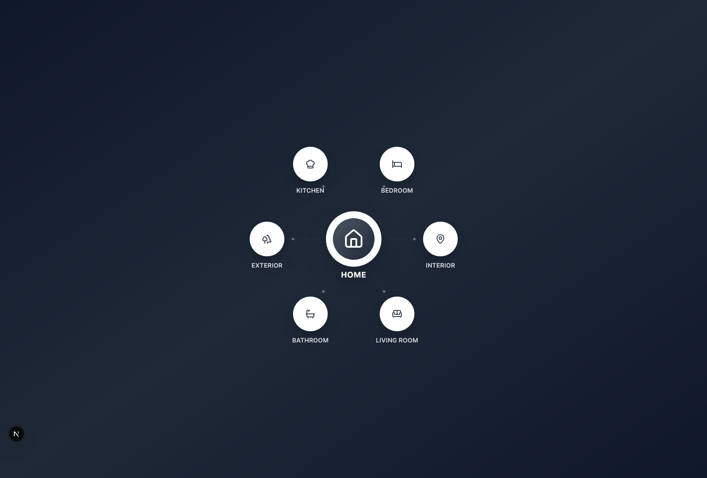
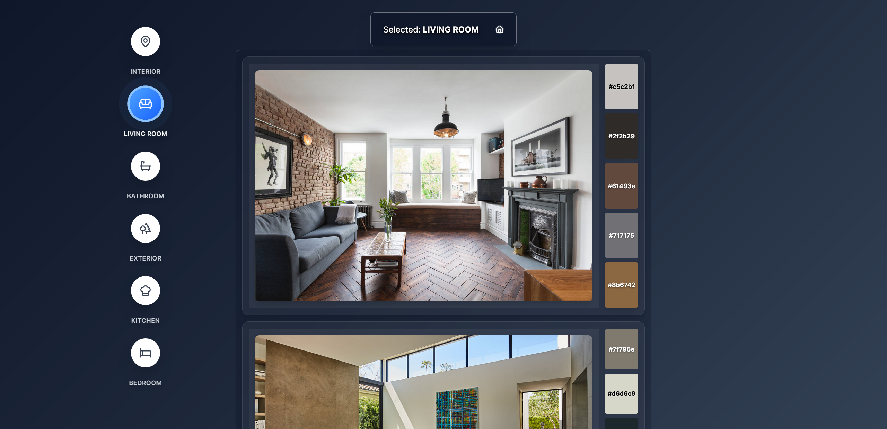

# House Mind Map

A modern, interactive Next.js application featuring a house mind map with a central home icon connected to different room categories.

## Preview





## Features

- **Modern Design**: Built with Next.js 14, TypeScript, and Tailwind CSS
- **Interactive Layout**: Central house icon with radiating connections to room buttons
- **Modern Icons**: Uses Lucide React for crisp, scalable icons
- **Responsive Animations**: Smooth hover effects and floating animations
- **Room Categories**: Interior, Exterior, Bathroom, Kitchen, Bedroom, and Living Room

## Tech Stack

- **Framework**: Next.js 14 with App Router
- **Language**: TypeScript
- **Styling**: Tailwind CSS
- **Icons**: Lucide React
- **Font**: Inter (Google Fonts)

## Getting Started

1. Install dependencies:

```bash
npm install
```

2. Run the development server:

```bash
npm run dev
```

3. Open [http://localhost:3000](http://localhost:3000) in your browser

## Project Structure

- `app/` - Next.js App Router directory
- `app/components/` - React components
- `app/globals.css` - Global styles and Tailwind CSS imports
- `app/layout.tsx` - Root layout component
- `app/page.tsx` - Home page

## Features in Detail

### Central House Icon

- Floating animation effect
- Gradient background with shadow
- Connected to all room buttons via animated lines

### Room Buttons

- Hover and selection states
- Smooth scaling animations
- Color-coded categories
- Interactive connection lines

### Modern Styling

- Dark gradient background
- Glass-morphism effects
- Responsive design
- Smooth transitions

## Customization

You can easily customize:

- Room categories by modifying the `rooms` array in `HouseMindMap.tsx`
- Colors and styling in `tailwind.config.js`
- Animations and layout in the component files

## License

MIT License - see LICENSE file for details
